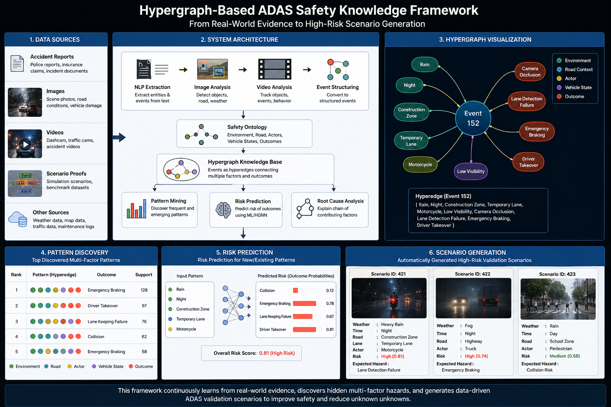
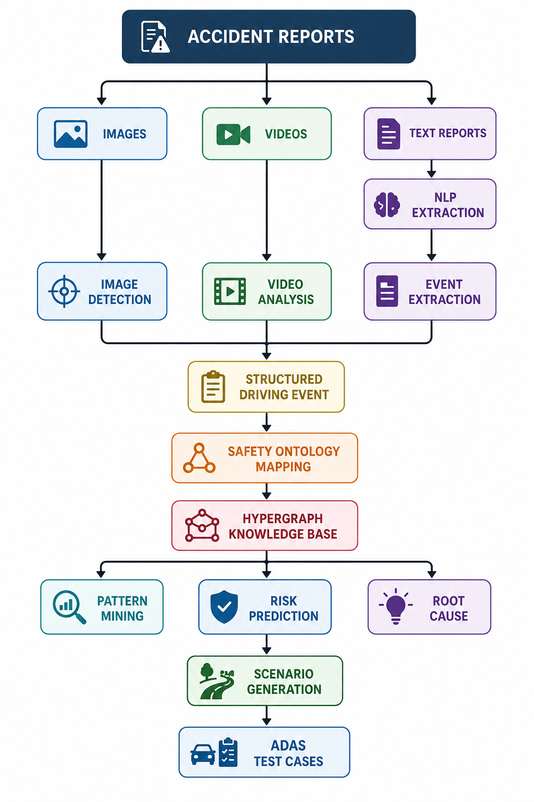
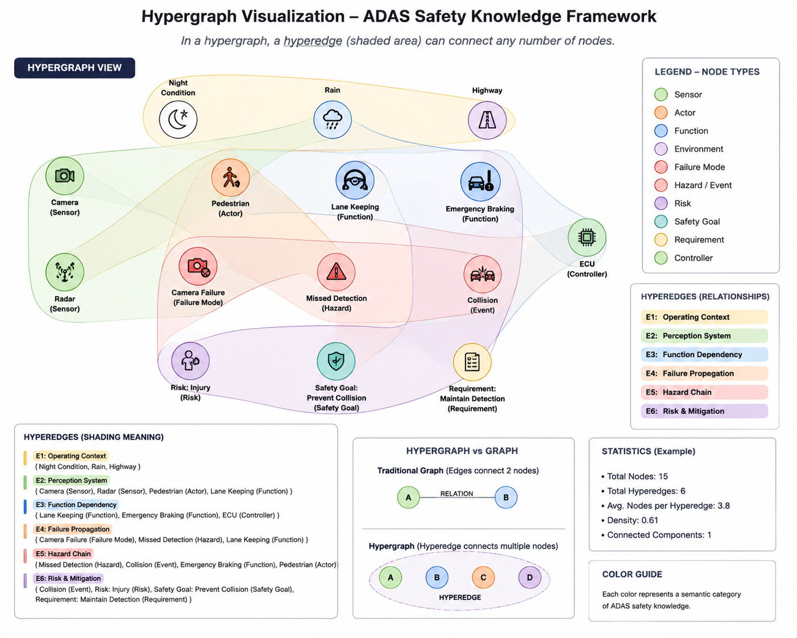

# HG-ASK Dataset v1.0
## Hypergraph-Based ADAS Safety Knowledge Dataset


---

## Overview

HG-ASK Dataset v1.0 is a synthetic, engineering-guided ADAS safety validation dataset produced under the **HASKF (Hypergraph-Based ADAS Safety Knowledge Framework)** by **GRAVITY ~ AI**.

Instead of representing safety data as simple pairwise graphs, HG-ASK encodes each validation scenario as a **hyperedge** — a single semantic unit connecting all relevant entities (weather, road, sensors, actors, ADAS function, hazard, risk, and outcome) at once. This preserves the full many-to-many context of real ADAS validation scenarios rather than fragmenting it into isolated relationships.

The dataset was generated using predefined **engineering rules** (based on ISO 26262, SOTIF, government statistics, and research literature) — no scenario was created by random combination.

<p align="center">
  
</p>

<p align="center">
  
</p>

---

## Dataset Statistics

| Property | Value |
|-----------|--------|
| Version | 1.0 |
| Total Scenarios | 5,000+ |
| Hyperedges | 5,000+ |
| Entity Types | 20+ |
| Attributes | 50 |
| ADAS Functions | 10+ |
| Collision Types | 12 |
| Weather Conditions | 8 |
| Lighting Conditions | 5 |
| Risk Levels | 4 |
| ASIL Levels | QM, A, B, C, D |

---

## Package Structure

```
HG-ASK-Dataset/
│
├── ADAS_Scenarios
├── Entities
├── Hyperedges
└── Rules
```

### 1. ADAS_Scenarios
Complete validation scenarios. One row = one scenario. Primary key: `Scenario_ID` (e.g. `SC0001`).

### 2. Entities
All unique entities used by the framework (e.g. Rain, Night, Camera, Radar, Pedestrian, AEB, Collision Risk). Each entity has an `Entity_ID`, `Entity_Type`, and `Entity_Name`.

### 3. Hyperedges
Each hyperedge connects multiple entities into one complete validation context, e.g.:

```
H001 = { Rain, Night, Camera, Radar, Pedestrian, AEB, High Risk }
```

### 4. Rules
Engineering rules used during synthetic scenario generation (see below).

---

## Scenario Fields (~50 attributes)

Scenario ID · Hyperedge ID · Collision Type · Weather · Lighting · Road Type · Road Geometry · ODD · Traffic Density · Lane Count · Speed Limit · Ego Speed · Target Speed · Relative Speed · Ego Vehicle · Target Object · Camera Status · Radar Status · LiDAR Status · GPS Status · IMU Status · Sensor Configuration · Sensor Confidence · Fusion Confidence · ADAS Function · Failure Mode · Hazard · Risk Level · Severity · ASIL · Safety Goal ID · Requirement ID · ISO26262 Trace · SOTIF Scenario · Expected Behaviour · Validation Result · Hyperedge Weight · Scenario Confidence · Natural Language Description

---

## Hypergraph Representation

A traditional graph expresses one relationship at a time (`Car — Rain`). A hyperedge instead binds the entire scenario context into a single unit:

```
Hyperedge H001
{
  Rain, Night, Highway, Camera, Radar, Pedestrian,
  80 km/h, AEB, Reduced Visibility, Collision Risk,
  ASIL D, Safety Goal SG001
}
```

<p align="center">
  
</p>

---

## Engineering Rule Base

### Environment Rules
- Rain → Reduced Camera Confidence
- Fog → Reduced Camera Range → Radar Preferred
- Snow → Reduced Lane Visibility → Lane Keeping Validation Required
- Night → Low Illumination → Pedestrian Detection Difficulty Increased

### Collision Rules
- Head-on Collision → Forward Collision Warning → AEB → ASIL D
- Rear-end Collision → Adaptive Cruise Control → AEB
- Side Collision → Blind Spot Detection → Lane Change Assist
- Run-off-road → Lane Keeping Assist → Electronic Stability Control
- Pedestrian Collision → Pedestrian AEB → Camera + Radar Fusion

### Sensor Rules
- Camera Failure → Radar Backup
- Radar Failure → Camera Degraded Mode
- LiDAR Failure → Camera + Radar Fusion
- Camera + Rain → Reduced Visibility → Low Confidence
- Night + Camera → Low Detection Confidence
- Fog + Camera → Detection Delay

### Safety Rules
- High Risk → ASIL C or D
- Critical Hazard → Safety Goal Required
- Safety Goal → Requirement Mapping Required
- Every Hazard → Minimum One ADAS Function
- Every ADAS Function → Expected Behaviour → Validation Result

### Hyperedge Rules
- One Scenario → Exactly One Hyperedge
- One Hyperedge → Multiple Connected Entities
- Entities may belong to multiple Hyperedges

---

## Dataset Constraints

Every scenario satisfies:

✓ At least one collision type
✓ At least one weather condition
✓ At least one lighting condition
✓ At least one sensor
✓ At least one ADAS function
✓ One hazard
✓ One risk level
✓ One ASIL
✓ One validation result
✓ One hyperedge

---

## Intended Applications

- Hypergraph learning & Hypergraph Neural Networks (HGNNs)
- Knowledge graph construction and comparison
- ADAS validation research
- Safety knowledge representation & reasoning
- Retrieval-Augmented Generation (RAG)
- Scenario generation
- Safety traceability analysis

---

## Limitations

This is a research-oriented **synthetic** dataset generated from engineering rules and public-domain safety concepts. It should not be interpreted as real-world crash records or official validation results.

---

## Citation

```
HG-ASK Dataset v1.0
Hypergraph-Based ADAS Safety Knowledge Dataset for Validation Scenario Generation
GRAVITY ~ AI, 2026
```

---

## Author

**GRAVITY ~ AI** — Hypergraph-Based ADAS Safety Knowledge Framework (HASKF), v1.0